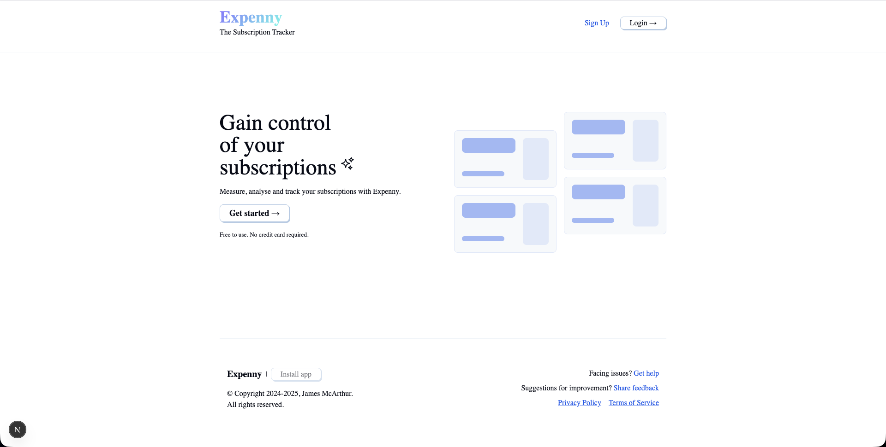
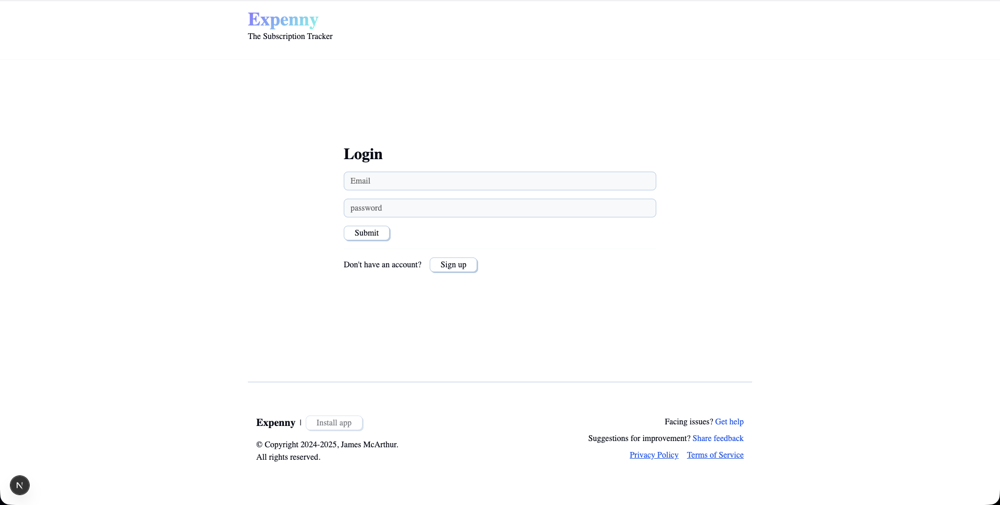
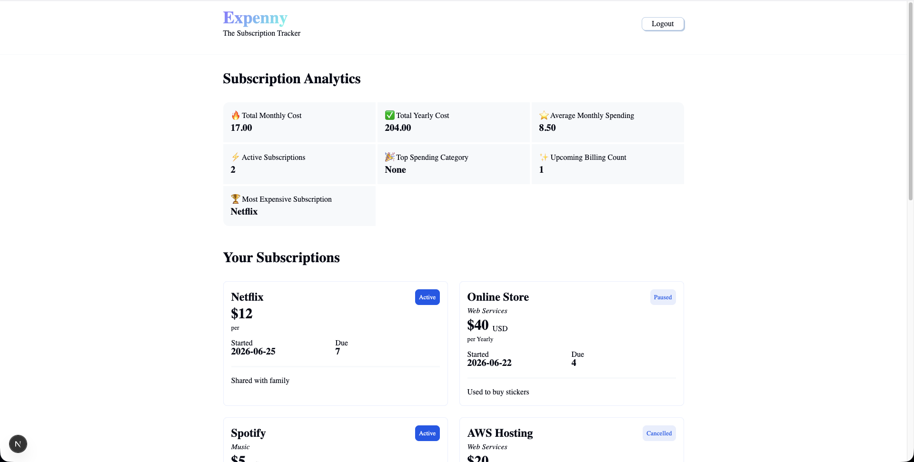

# 📊 Expenny — Subscription Tracker

Take control of your subscriptions and understand where your money goes.

Expenny is a full-stack subscription tracking web application built with **Next.js** and **Firebase Authentication**, designed to help users manage recurring expenses, monitor spending habits, and gain insights into subscription usage.

Built with a clean, modern interface styled using **FantaCSS by Smoljames**.

---

## ✨ Features

*  User authentication with Firebase
*  Secure login and personalized user experience
*  Track active subscriptions and recurring expenses
*  Subscription analytics and spending summaries
*  Upcoming billing insights
*  Categorize subscriptions
*  Fast navigation and modern UI with Next.js
*  Responsive design across devices

---

## 🧰 Tech Stack

### Frontend

* Next.js
* React
* JavaScript

### Backend / Authentication

* Firebase Authentication

### Styling

* FantaCSS (created by Smoljames)

### Deployment

* Netlify

---

## 🏗️ Architecture

```text
Client (Next.js)
       ↓
Firebase Authentication
       ↓
User Session
       ↓`
Subscription Data
       ↓
Analytics Dashboard
```

---

## 📸 Preview

## Landing page



## Login



## Dashboard



---

## Getting Started

Clone the repository:

```bash
git clone <your-repository-url>
```

Move into the project:

```bash
cd <your-project-folder>
```

Install dependencies:

```bash
npm install
```

Create an environment file:

```text
.env.local
```

Add your Firebase configuration:

```env
NEXT_PUBLIC_FIREBASE_API_KEY=
NEXT_PUBLIC_FIREBASE_AUTH_DOMAIN=
NEXT_PUBLIC_FIREBASE_PROJECT_ID=
NEXT_PUBLIC_FIREBASE_STORAGE_BUCKET=
NEXT_PUBLIC_FIREBASE_MESSAGING_SENDER_ID=
NEXT_PUBLIC_FIREBASE_APP_ID=
```

Run the development server:

```bash
npm run dev
```

Open:

```text
http://localhost:3000
```

---

## 📂 Project Structure

```text
app/
components/
context/
public/
utils/

firebase.js
package.json
```

---

## 📊 Core Analytics

Expenny provides subscription insights including:

* Total monthly spending
* Total yearly spending
* Average monthly cost
* Active subscription count
* Top spending category
* Upcoming billing reminders
* Most expensive subscription

---

## 🔮 Future Improvements

* Email reminders for renewals
* Budget tracking
* Subscription cancellation suggestions
* Charts and visual analytics
* Multi-currency support
* Export subscription reports

---

## 🙌 Credits

UI styling powered by **FantaCSS** by **Smoljames**

Built with **Next.js** and **Firebase**

---

## 👩‍💻 Author

Built by **Rachel Roshni**
